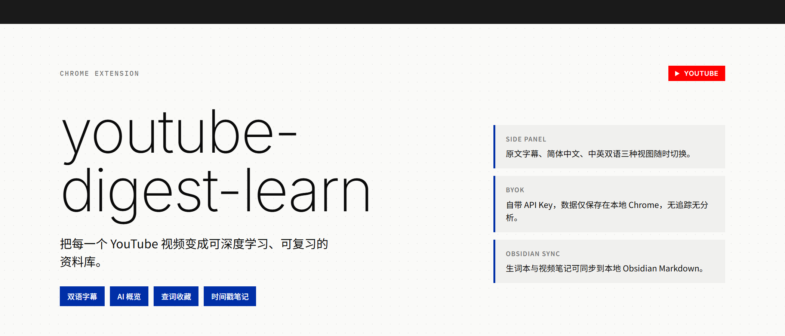

# youtube-digest-learn



[English](README.md) | [简体中文](README.zh-CN.md)

把每个 YouTube 视频变成一份可以深入学习的资料。youtube-digest-learn 是一款 Chrome 浏览器扩展，它将 YouTube 字幕、双语翻译、AI 概览、内容讲解与时间戳笔记整合在同一个侧边栏中，让你在观看视频的同时，不丢失上下文，持续学习视频中的知识与语言。

---

## 目录

- [功能特性](#功能特性)
- [系统要求](#系统要求)
- [安装方法](#安装方法)
  - [方式一：让编程 Agent 帮你安装（推荐）](#方式一让编程-agent-帮你安装推荐)
  - [方式二：手动安装](#方式二手动安装)
- [获取 API Key](#获取-api-key)
  - [Supadata API Key（必需）](#supadata-api-key必需)
  - [DeepSeek API Key（必需）](#deepseek-api-key必需)
  - [Merriam-Webster API Key（可选）](#merriam-webster-api-key可选)
- [配置插件](#配置插件)
- [使用指南](#使用指南)
- [Obsidian 同步（可选）](#obsidian-同步可选)
- [价格与成本估算](#价格与成本估算)
- [故障排除](#故障排除)
- [隐私说明](#隐私说明)
- [自定义与扩展](#自定义与扩展)
- [开源许可](#开源许可)

---

## 功能特性

- **字幕转学习资料**：将零碎的 YouTube 字幕整理成清晰、可搜索、带时间戳的学习文本。
- **多语言字幕视图**：支持**原文**、**简体中文**、**中英双语对照**三种视图，满足不同语言学习需求。
- **AI 概览与章节**：自动生成视频大纲、章节分段、重点引用，帮助快速建立系统理解。
- **选中即讲解**：选中任意字幕文本，即可让 AI 解释其中含义与背景。
- **查词与收藏**：选中单个英文单词，可查看 Merriam-Webster 释义、发音、例句，以及基于当前字幕句子的中文语境解释；收藏的单词会保存在本地生词本中。
- **时间戳笔记**：在观看过程中保存重点片段的笔记，支持自动润色，方便复习。
- **Obsidian 同步**：可选将生词本、视频笔记、双语逐字稿同步到本地 Obsidian Markdown 中。
- **数据自主可控**：使用你自己的 API Key，所有设置与数据保存在 Chrome 本地，无账号系统、无广告、无分析统计、无行为追踪。

---

## 系统要求

- **浏览器**：Google Chrome 116 或更高版本（需支持 Side Panel API）。
- **页面**：标准的 `https://www.youtube.com/watch?...` 视频页面。
- **视频**：需要是公开视频，且 Supadata 能获取到原生字幕（优先请求英文字幕）。
- **不支持**：YouTube Shorts、直播、私密视频、受访问限制的视频、没有原生字幕的视频。
- **其他浏览器**：Firefox、Safari、移动端浏览器或其他 Chromium 浏览器目前未测试、不支持。

---

## 安装方法

本项目为本地加载的扩展，目前没有上架 Chrome 应用商店。你需要手动或通过编程 Agent 安装。

> 安装前提示
>
> 1. 安装前请准备好 [Supadata](#supadata-api-key必需) 和 [DeepSeek](#deepseek-api-key必需) 的 API Key（见下文）。
> 2. 安装后不要随意移动或删除项目文件夹，否则 Chrome 中的扩展会失效。
> 3. 更新版本时，需要先重新加载扩展。

### 方式一：让编程 Agent 帮你安装（推荐）

如果你不想自己操作命令行，可以把下面这段话发送给你的编程 Agent：

> 请帮我把这个项目 https://github.com/Liliane0310/youtube-digest-learn 下载或克隆到我指定的一个长期保留的文件夹，告诉我准确的完整路径，然后指导我在 Chrome 中通过「加载已解压的扩展程序」使用同一个文件夹安装。如果我不知道放哪里，可以建议 macOS/Linux 放 `~/Documents/youtube-digest-learn`，Windows 放 `%USERPROFILE%\Documents\youtube-digest-learn`。请用简单易懂的语言一步步带我完成安装和配置。

Agent 应该会帮你完成：

1. 询问并确定一个长期保存位置，下载或克隆项目。
2. 指导你注册 Supadata 和 DeepSeek 账号并创建 API Key。
3. 打开 Chrome 的 `chrome://extensions`，开启右上角「开发者模式」。
4. 点击「加载已解压的扩展程序」，选择包含 `manifest.json` 的项目文件夹。
5. 在扩展的设置页面填写 API Key。
6. 打开一个带字幕的 YouTube 视频，测试功能是否正常。

### 方式二：手动安装

1. 访问项目仓库 [github.com/Liliane0310/youtube-digest-learn](https://github.com/Liliane0310/youtube-digest-learn)。
2. 点击页面上的 **Code** → **Download ZIP**，下载项目压缩包。
3. 将压缩包解压到一个你准备长期保留的文件夹，例如：
   - macOS / Linux：`~/Documents/youtube-digest-learn`
   - Windows：`%USERPROFILE%\Documents\youtube-digest-learn`
4. 打开 Chrome 浏览器，在地址栏输入 `chrome://extensions` 并回车。
5. 打开右上角的「开发者模式」开关。
6. 点击左上角出现的「加载已解压的扩展程序」按钮。
7. 在弹出的文件选择框中，选中第 3 步解压出来的、包含 `manifest.json` 的项目文件夹，然后点击「选择文件夹」。
8. 回到 `chrome://extensions` 页面，你应该能看到 `youtube-digest-learn` 的扩展卡片。
9. 建议点击 Chrome 工具栏的扩展图标右侧的图钉按钮，将扩展固定到工具栏，方便使用。

#### 更新或重新加载

- 下载新版本或修改代码后，在 `chrome://extensions` 找到 `youtube-digest-learn` 卡片，点击「重新加载」。
- 重新加载后，刷新已经打开的 YouTube 页面。
- 如果移动或删除了项目文件夹，扩展会失效，需要重新「加载已解压的扩展程序」选择新的位置。

---

## 获取 API Key

youtube-digest-learn 采用「自带 API Key」（Bring Your Own Key，BYOK）模式。你需要自行准备以下 Key：

| 服务 | 用途 | 是否必需 |
|------|------|----------|
| Supadata | 获取 YouTube 字幕 | 必需 |
| DeepSeek | AI 概览、翻译、讲解、润色笔记 | 必需 |
| Merriam-Webster | 英文单词释义、发音、例句 | 可选 |

> 安全提示
>
> 不要把 API Key 粘贴到 AI 对话、截图、源代码或公开消息中。只在 youtube-digest-learn 的设置页面填写。

### Supadata API Key（必需）

Supadata 用于获取 YouTube 视频的原生字幕。

1. 打开 Supadata 官方注册页面：[dash.supadata.ai/auth/sign-up](https://dash.supadata.ai/auth/sign-up)。
2. 使用邮箱或 Google 账号注册一个新账号。
3. 完成简短的新手引导流程，系统会自动生成一个 API Key。
4. 之后你可以随时登录 [Supadata 控制台](https://dash.supadata.ai/) 查看或管理 Key。
5. 复制 Key，粘贴到 youtube-digest-learn 设置页面的 **Supadata API key** 字段中。

如需了解详情，可查看 [Supadata 官方文档](https://docs.supadata.ai/)。

### DeepSeek API Key（必需）

DeepSeek 用于生成 AI 概览、翻译、文本讲解和自动润色笔记。

1. 打开 DeepSeek 开放平台：[platform.deepseek.com/api_keys](https://platform.deepseek.com/api_keys)。
2. 使用邮箱或手机号注册并登录 DeepSeek 账号。
3. 点击 **Create new API key**（创建新 API Key）。
4. 填写一个容易识别的名称，例如 `youtube-digest-learn`，然后点击创建。
5. 创建成功后，**立即复制完整的 API Key**，因为完整 Key 通常只会显示一次。
6. 粘贴到 youtube-digest-learn 设置页面的 **AI API key** 字段中。
7. 如果使用时提示余额不足，需要在 DeepSeek 开放平台充值后再使用。

默认使用的模型配置如下：

```text
Base URL: https://api.deepseek.com
Model: deepseek-v4-flash
```

如需使用其他兼容 OpenAI 协议的后端，可以在设置中自定义服务名称、Base URL、模型名和 API Key。

### Merriam-Webster API Key（可选）

Merriam-Webster 用于提供学习者友好的英文释义、例句和发音。

1. 打开 [Merriam-Webster Dictionary API 注册页面](https://www.dictionaryapi.com/register/index)。
2. 填写注册表单（所有字段均为必填）：
   - **First Name / Last Name**：你的真实姓名。
   - **E-mail Address / Confirm E-mail Address**：用于登录和接收验证邮件的邮箱。
   - **Password / Confirm Password**：至少 7 位字符的密码。
   - **Estimated Monthly Unique Users**：预计每月使用人数，个人使用可填写 `1` 或 `1-10`。
   - **Role/Occupation**：填写你的角色，例如 `Independent Developer` 或 `Student`。
   - **Request API Key (1)**：勾选 **Learners Dictionary**（学习者词典，推荐首选）。
   - **Request API Key (2)**（可选）：勾选 **Collegiate Dictionary** 作为补充词典（每个账号最多可申请 2 个 Key）。
   - **Company or Organization Name**：独立开发者请填写 `self`。
   - **Application Name**：填写 `youtube-digest-learn`。
   - **Application Description**：简要描述，例如 `A Chrome extension that helps users learn languages from YouTube videos with dictionary lookup.`。
   - **Application URL**：可填写项目仓库地址 `https://github.com/Liliane0310/youtube-digest-learn`，如无则填 `N/A`。
   - **Application Launch Date**：选择当前月份或预计使用时间。
3. 提交后，查收邮箱验证邮件，点击邮件中的链接完成注册。
4. 注册完成后，登录 [My Keys](https://www.dictionaryapi.com/my-keys) 页面查看 Key。
5. 在 youtube-digest-learn 设置页面的对应字段填写 Learner's Dictionary Key 和 Collegiate Dictionary Key。

---

## 配置插件

安装完成后，第一次使用前需要填写 API Key：

1. 点击 Chrome 工具栏上的 youtube-digest-learn 扩展图标，打开侧边栏。
2. 在侧边栏中找到并点击 **Settings**（设置）。
3. 在设置页面中填写：
   - **Supadata API key**：从 Supadata 控制台复制的 Key。
   - **AI API key**：从 DeepSeek 或其他兼容后端复制的 Key。
   - 如果使用自定义 AI 后端，填写 Base URL、模型名等信息。
   - 如果使用 Merriam-Webster 查词，填写对应 Key。
4. 点击 **Save**（保存）。
5. 如果浏览器弹出请求访问 api 域名的提示，请点击允许。

完成配置后，打开一个带字幕的 YouTube 视频即可开始使用。

---

## 使用指南

### 1. 打开侧边栏

1. 打开一个标准的 YouTube 视频页面（`https://www.youtube.com/watch?...`）。
2. 等待页面加载完成后，点击 Chrome 工具栏上的 youtube-digest-learn 扩展图标，即可打开侧边栏。
3. 扩展会自动请求当前视频的字幕。

### 2. 查看字幕

侧边栏打开后，默认显示 **Transcript**（字幕）标签页：

- 点击 **Original**：显示视频原文字幕。
- 点击 **中文**：显示简体中文翻译。
- 点击 **双语**：显示原文与中文对照。
- 点击任意字幕行左侧的时间戳，视频会跳转到对应位置。
- 使用搜索框可以快速查找字幕中的关键词。

### 3. 使用 AI 概览

切换到 **Overview**（概览）标签页：

- 自动生成视频章节、重点引用和整体摘要。
- 点击重点引用中的时间戳可跳转播放。
- 概览内容基于字幕和 AI 生成，适合快速了解视频结构。

### 4. 选中字幕获取讲解

- 在字幕区域选中一段文字。
- 点击出现的 **Explain**（讲解）按钮。
- AI 会根据当前字幕上下文，为你解释这段内容。

### 5. 查词与收藏

- 在字幕中选中一个英文单词。
- 点击出现的 **查词** 按钮。
- 查看释义、发音、例句和 AI 语境解释。
- 点击卡片上的星标，即可将单词加入本地生词本。
- 之后可以在 **Vocabulary**（生词）标签页中查看所有收藏的单词。

### 6. 记录时间戳笔记

- 在视频播放过程中，遇到重点内容时点击视频下方的 **Save note** 按钮（或在重点引用中点击保存）。
- 笔记会自动带上当前视频的时间戳。
- 在 **Notes**（笔记）标签页中查看、编辑或润色笔记。
- 点击笔记时间戳可快速回到视频对应位置。

### 7. 导出与同步

- 如果开启了 Obsidian 同步，生词本和视频笔记会自动同步到本地 Obsidian。
- 在 Transcript 标签页中点击 **Sync Obsidian**，可以手动同步当前视频的双语逐字稿。

---

## Obsidian 同步（可选）

如果你想把学习内容同步到 Obsidian，请按以下步骤配置：

1. 打开 Obsidian，进入「设置」→「社区插件」→ 浏览并安装 `Local REST API with MCP`。
2. 启用该插件，并打开非加密的 HTTP 服务。
3. 复制插件生成的 API Key。
4. 在 youtube-digest-learn 设置中启用 **Obsidian sync**。
5. 默认地址为 `http://127.0.0.1:27123`，如果插件显示的是其他地址，请填写对应地址。
6. 设置生词本的 Markdown 文件路径，以及视频笔记的存放文件夹。
7. 粘贴 Obsidian 插件生成的本地 API Key，保存后点击 **Test connection** 测试连接。

同步规则：

- 收藏的单词会写入一篇受管生词本 Markdown。
- 每个视频会生成一篇独立的 Markdown，其中笔记和逐字稿使用受管区块。
- 笔记自动同步；逐字稿需要手动点击同步按钮。
- 受管区块外的手写内容会保留，不会被覆盖。

---

## 价格与成本估算

### Supadata 费用

截至 2026 年 8 月，[Supadata 价格页面](https://supadata.ai/pricing)显示免费版每月提供 **100 credits**，无需信用卡，未使用额度不结转。

- 获取一次原生字幕：**1 credit**。
- AI 生成字幕：**2 credits / 分钟**（本项目不使用）。
- 无原生字幕返回 HTTP 206 时，仍会消耗 **1 credit**。

按本项目仅使用原生字幕的方式，免费版每月大约可查询 100 个视频（实际数量可能因重试和无字幕查询而减少）。

### DeepSeek 费用

截至 2026 年 8 月，DeepSeek V4 Flash 的参考价格如下（请以官方最新价格为准）：

- 缓存命中输入：约 $0.0028 / 百万 tokens
- 缓存未命中输入：约 $0.14 / 百万 tokens
- 输出：约 $0.28 / 百万 tokens

实际使用成本取决于你选择的翻译、AI 概览、讲解等功能的使用频率，以及字幕长度。一般而言，完整翻译一个 20 分钟英文视频的成本大约在 **$0.002 到 $0.006 美元**之间。

---

## 故障排除

### 扩展图标旁没有出现 Digest 按钮

- 在 `chrome://extensions` 中找到 youtube-digest-learn，点击「重新加载」，然后刷新 YouTube 页面。
- 确认当前页面是标准的 `https://www.youtube.com/watch?...`，不是 Shorts、直播或嵌入页面。
- 当前版本会自动跟随 YouTube 响应式操作栏变化重新定位按钮，页面加载后稍等片刻。
- 如果仍然不显示，可以让编程 Agent 在该视频页面检查 content script 是否正确加载。

### 侧边栏打不开

- 确认你打开的是标准 YouTube 视频页面。
- 在 `chrome://extensions` 中确认扩展已启用，并点击「重新加载」。
- 重新加载后刷新 YouTube 页面。
- 如果仍有问题，检查控制台报错或让 Agent 检查扩展状态。

### 提示需要设置 API Key

- 打开扩展 **Settings**，填写并保存 Supadata 和 AI 后端 Key。
- 如果使用自定义后端，确认 Base URL、模型名和 API Key 填写正确。
- 保存自定义后端时，允许 Chrome 请求访问对应域名。

### 找不到字幕

- 确认视频是公开的，并且有原生字幕。
- 检查 Supadata Key 是否正确、额度是否充足、是否触发限速。
- 无字幕的查询和手动重试也可能消耗额度。
- 本项目不会在没有原生字幕时 fallback 到 AI 生成字幕。

### AI 请求失败

- `401` 或 `403`：通常表示 API Key 或账号权限有问题。
- `429`：通常表示达到服务商限速或消费上限。
- 确认 Base URL 包含 `/v1` 等必要路径，模型名完全正确。
- 确认后端支持 OpenAI 兼容的 `POST /chat/completions`。
- 检查账号余额是否充足。

### Obsidian 同步失败

- 确认 `Local REST API with MCP` 插件已启用，并且非加密 HTTP 服务已开启。
- 确认地址和 API Key 与插件中显示的一致。
- 确认 Obsidian 正在运行，且没有防火墙或安全软件拦截本地回环地址。
- 点击 **Test connection** 查看具体错误信息。

---

## 隐私说明

youtube-digest-learn 没有账号系统、广告、分析统计或行为追踪。数据流向如下：

1. **Supadata**：向 Supadata 发送 YouTube 视频 URL，用于获取原生字幕。
2. **AI 后端**：当你使用 AI 功能时，向 DeepSeek 或其他兼容后端发送字幕和必要的上下文。
3. **本地存储**：API Key、设置、笔记和最近缓存保存在 Chrome 本地扩展存储中。
4. **Obsidian**：如果启用同步，会通过你配置的本地回环地址将 Markdown 发送到 Obsidian。

Supadata 和你配置的 AI 服务会按照各自的条款和隐私政策处理数据。更多详情请查看 [PRIVACY.md](PRIVACY.md)。

---

## 自定义与扩展

youtube-digest-learn 使用原生 HTML、CSS 和 JavaScript 编写，没有构建步骤，适合用编程 Agent 进行个性化改造。

你可以尝试：

- 增加更多翻译语言，让每个人都能选择自己的学习语言。
- 为课程、访谈、教程、测评或研究视频定制总结模板。
- 自定义生词本的复习字段或 Markdown 排版。
- 把笔记和生词导出到 Markdown、CSV、Anki 等学习工具。
- 增加主题筛选，只突出与目标相关的章节。
- 完善对本地 OpenAI 兼容模型的支持。
- 改善键盘操作、字体大小、高对比度等无障碍体验。

修改项目后，建议运行：

```bash
npm test
npm run check
npm run package
```

并在 Chrome 中重新加载扩展，用真实 YouTube 视频测试效果。

---

## 开源许可

MIT。详见 [LICENSE](LICENSE)。
